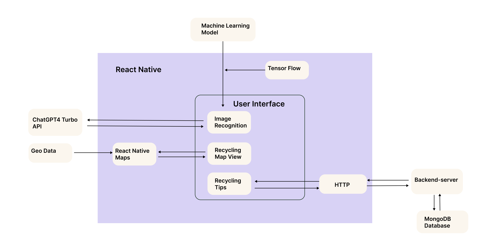
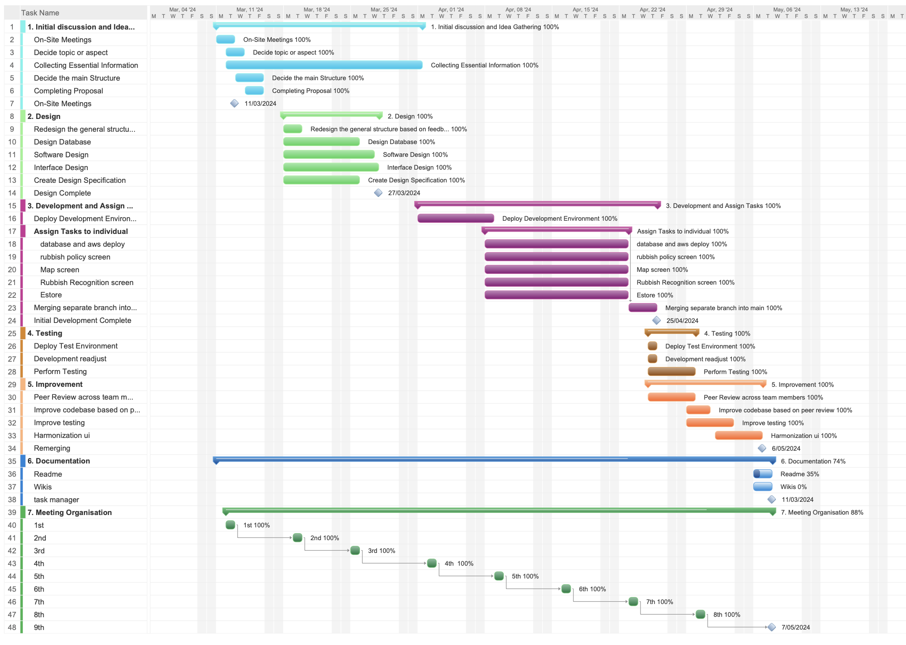

# Group Project: A Mobile App Focusing on Recycling Solutions

<br>
<br>

## Overview
Welcome to the GitHub repository for the Happy Herons team's project! Our project aims to enhance the recycling experience in New Zealand, especially for international newcomers. This app simplifies the recycling process by providing a user-friendly platform that guides users in properly disposing of their waste, and help them navigate through clothing recycling and donation locations in Auckland and latest recycling tips. Additionally, the app allows users to browse eco-friendly products.
<br>
<br>

This application is built with React Native and incorporates Tailwind CSS for styling. Key features include image recognition powered by a machine learning model and ChatGPT4 Turbo API for disposal instructions under online and offline modes, an interactive map, utilizing React Native Maps library, for displaying key clothing recyling locations, and recycling tips based on latest recyling policies. Moreover, our app employes Jest for robust unit testing to improve reliabilty and performance. 

<br>


## Application Architecture



## Installation

### Prerequisite
Ensure you have the following installed:
- [Node.js](https://nodejs.org/en/)

### Installing iOS Simulator or Android Emulator
For compatibility reasons, we recommend using the virtual device `iPhone 15 Pro Max with iOS 17.4` simulator on Macs, or the virtual device `Pixel 7a with API 34` Android emulator on both Macs and Windows.

#### iOS Simulator:
The iOS Simulator is a tool within Xcode that allows developers to test and debug iOS applications on Macs.
1. **Install Xcode:** Download and install Xcode from Mac App Store.
2. **Open Xcode:** Go to `Xcode > Settings > Platforms`, and install `iOS 17.4` from the list.

#### Android Emulator:
The Android Emulator is a tool within the Android Studio that allows developers to test and debug Android applications on Macs or Windows.
1. **Install Android Studio:** Download and install [Android Studio](https://developer.android.com/studio).
2. **Open Android Studio:** Go to `Configure > Virtual Device Manager`, and select `Pixel 7a API 34` from the list.
<br>

>**For Mobile Phone Users:** 
>- Install the Expo Go app on an iPhone 12 Pro Max or newer, or on a Pixel 7a or newer Android device, for compatibility reasons. Then, scan the QR code generated after starting the app.
>- Ensure your mobile phone and computer are connected to the same Wi-Fi network. Also, confirm that you have granted the Expo Go app Local Network permission in your device's settings app. Alternatively, consider using the tunnel connection option if connectivity issues persist.
<br>
<br>

### Cloning the Repository
To clone the repository, use the following command:
```bash
git clone https://github.com/UOA-CS732-SE750-Students-2024/project-group-happy-herons.git
```

### Installing Dependencies
After cloning the project, install the dependencies using npm:
```bash
cd Group-Happy-Herons-Project
npm install
```

### Starting the Application
After installing the dependencies, you can start the application with the following command:
```bash
npx expo start
```

And then, for iOS Simulator or Android Emulator, press `i` or `a` respectively to open the application in the respective simulator.

If everything is set up *correctly*, the application should appear in your *iOS Simulator* or *Android Emulator* shortly. 

>The videos below demonstrate how the application operates on an iOS mobile device and an Android emulator.

<b>iOS Mobile Device</b>: 
<br>
<b>Android Emulator</b>: 


<br>
<br>

## Technologies Used

### Expo
Our app is built on Expo, which is a framework built around React Native and enables developers to build cross-platform mobile app. We chose expo primarily becasue it provides access to a wide range of native device APIs through Expo SDK. This includes features like camera, location, and map, which we can integrate into our app without dealing with native code.

### Image Recognition and Information Retrieval

This section of our project describes the integration of TensorFlow.js with React Native for offline image recognition, and the utilization of the ChatGPT API for online information retrieval. The functionality facilitates rubbish classification and provides users with detailed information about identified items.And the modes are controlled by users and internet connections.

<b>Image Selection Process:</b> Before processing any images for classification, users must select an image either from their device's camera or from their photo library. This functionality is managed by the UploadOptions component and uses  `expo-image-picker` library to facilitate image capturing and selection.

- Camera Access: Allows users to take a new photo using their device's camera.
- Library Access: Users can select an existing photo from their device's media library.
- Permissions: Automatically requests and checks necessary permissions for camera and library access.

<b>Offline Mode</b>: The TensorFlow.js model is used within the React Native app to classify images of rubbish directly on the user's device, operating fully offline.

- TensorFlow.js is integrated using the `@tensorflow/tfjs-react-native` adapter, allowing the machine learning model to run directly on mobile devices without needing internet access.

- The model is pre-trained and bundled with the app, enabling instant image processing and classification.

The model is loaded asynchronolously when the app starts and the useModel hook (as shown below) initializes TensorFlow.js, loads the model from local assets, and sets up the model for use in the app.

#### Online Mode

In online mode, the application uses the OpenAI GPT-4 Turbo model to provide detailed disposal instructions for identified items. This feature requires an internet connection and utilizes the ChatGPT API to process images and return actionable information based on the image content.

The function constructs an HTTP POST request using `axios` with a set of headers including the `API key`. The request payload specifies that the model should treat the incoming image URL (embedded as a base64 string) and provide disposal instructions based on predefined criteria.


To use this function, pass a base64 encoded image to sendImageToOpenAI. It returns a JSON response containing the appropriate disposal method and brief instructions.

### Map and Marker
The Map and Marker components are responsible for rendering clothing recycling bins or major donation sites around Auckland with markers. These components are indispensable for displaying available clothing recycling resources in an integrated approach. They address the common problems highlighted in Reddit and Facebook discussions, where users are unable to find nearby recycle bins or donation sites.

The component primarily utilizes the React Native Maps library, identified as @react-native-maps. This library includes a MapView component for rendering maps within React Native applications. It supports various props to customize its appearance and behavior, such as "region" for controlling the displayed area of the map, and "onRegionChangeComplete" for handling events when the user stops moving the map. Additionally, it integrates the Marker component, which displays markers on the map at specified geographic coordinates

### MongoDB Atlas
Our database choice is MongoDB Atlas, a fully managed cloud database service that significantly simplifies database management. It is particularly suitable for handling the diverse and unstructured data utilized in our app and enhances our app's efficiency in data retrieval and storage.


### Tailwind CSS
We use NativeWind library to integrate Tailwind CSS directly into React Native. This library provides a universal styling system that facilitates a consistent design scheme across both web application using React and mobile applications using React Native.
To use this library, run the following command:
```bash
npm install nativewind
npm install --save-dev tailwindcss@3.3.2
```
To setup Tailwind CSS in the project, create a `tailwind.config.js` file in the root directory and modify `babel.config.js` to add the Babel plugin for Tailwind CSS. 

### Animations
We primarily use React Native Reanimated and Lottie libraries across various screens within our application. These tools help enhance the user interface and improve user experience significantly.

Lottie provides renders rich animations for enhancing user experience and allows developers to use animations as easily as they use static images through merely dowloading animation JSON files. It is employed on our recycling tips screen for the click effects on bins. React Native Reanimated offers more flexibility and finer control over the animation processes. This library is utilized for implementing the carousel slides on the onboarding page and the opacity transition effects on the home screen. 
<br>
<br>

## Testing
In this project, unit testing is included to ensure the proper functioning of components and the correct rendering of content. We primarily use the `jest-expo` package, which is a Jest preset that mocks the native components of the Expo SDK and handles most of the configuration automatically. We also use an in-memory MongoDB database and the "supertest' library to implement database connectivity test, ensuring the database is connected properly before running tests, and endpoint Tests, ensuring correct items are returned based on the given category.

In the Map and Marker section, our primary goal is to ensure that the components render without crashing and that the map and markers are displayed as expected. In the Recycling Tips section, our goal is to ensure components on the Recycling Tips screen display the correct waste bin data. In the Eco Store section, we implemented tests to ensure the product list loads and displays correctly and clicking on a product card will navigate to the corresponding detail page.

The configuration for jest-expo is specified in the `jest.config.js` file, which sets the preset and module name mapper for the project. The test files are located in the `__tests__` directory, with each component having its own test file. For instance, the `MapScreen.test.js` file contains test cases specifically for the MapScreen component.

<br>
<br>

## Deploy Solution
For the convenience of interacting with the server, we deployed the server on AWS EC2 instances to smooth fetching data from our MongoDB database.
<br>
<br>

## Project Management
### Team Collaboration and Meetings

- Regular Meetings: Our team held weekly meetings every Tuesday (adjust depending on individual needs or progress) online or on campus to discuss project progress, address any issues, and plan for the upcoming week. Meeting minutes are available in the Wiki section of our GitHub repository.
  
- Communication Tools: We used WeChat for daily communication and projectManager (as shown in the below image) to track tasks and deadlines and ensure all team members stayed informed and engaged.

### Version Control and Workflow

- Git Workflow: We adopted the branch workflow. This approach helped us manage the development of new features without disturbing the main codebase. Each feature was developed in a separate branch and reviewed through pull requests before merging into the main.

- Code Reviews: Pull requests were used to review all code changes. This practice ensured code quality and shared understanding of the codebase among team members.


### Task Management

- Task Assignment: Tasks were assigned during our first couple of weekly meetings based on team members' skills and learning goals. The  details can be found on our projectManager board, which reflects the current status of each task, including 'To Do,' 'Doing,' and 'Done.'
- 
- Progress Tracking: Progress was tracked using ProjectManager, where team members regularly updated tasks.

### Quality Assurance

- Code Reviews: All pull requests underwent thorough reviews by at least two other team members before merging to ensure quality and consistency.

### Regular Contributions and Commits

- Commit Logs: Our commit logs reflect regular contributions from all team members. Each commit clearly describes the implemented changes, ensuring traceability and transparency.

- Peer Reviews: Each piece of code was peer-reviewed, fostering knowledge sharing and collective code ownership.

<br>
<br>


## Authors - Team Happy Herons
[Xiangnan Lu](https://github.com/UOA-CS732-SE750-Students-2024/project-group-happy-herons/tree/ImgR), 
[Zheyang Cao](https://github.com/UOA-CS732-SE750-Students-2024/project-group-happy-herons/tree/database), 
[Jinquan Wen](https://github.com/UOA-CS732-SE750-Students-2024/project-group-happy-herons/tree/estore), 
[Xin Yue](https://github.com/UOA-CS732-SE750-Students-2024/project-group-happy-herons/tree/homeui), 
[Ze Yin](https://github.com/UOA-CS732-SE750-Students-2024/project-group-happy-herons/tree/mapandmarker), 
[Yan Li](https://github.com/UOA-CS732-SE750-Students-2024/project-group-happy-herons/tree/bins)
<br>
<br>

